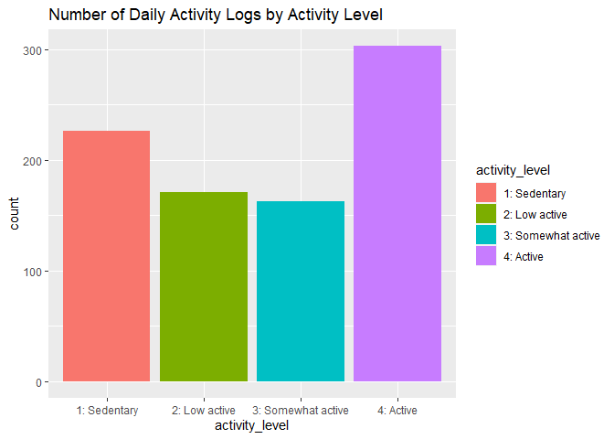
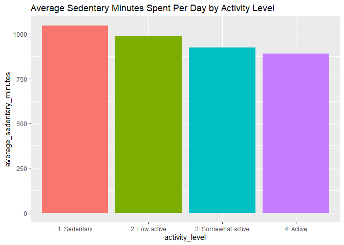
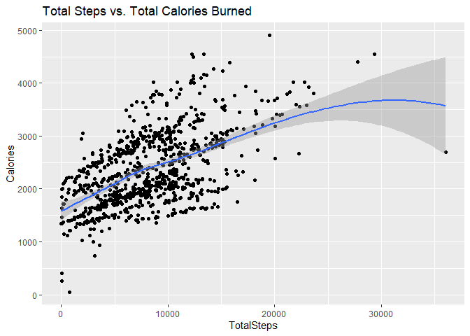
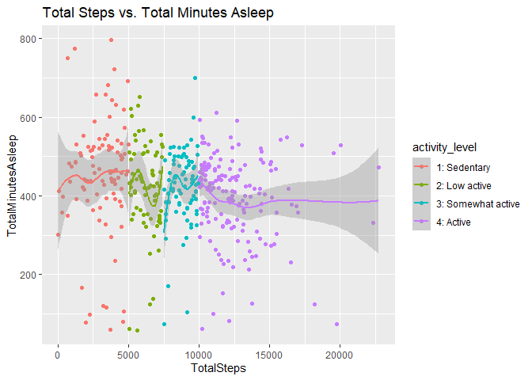
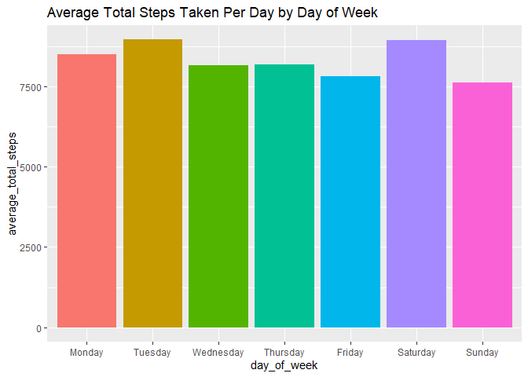

analyzing_SmartWatch_data_for_bellabeat
================
Mahitha Potti
2022-03-19

## Bellabeat Case Study

By: Mahitha Potti

### **Mission:**

Bellabeat is a high-tech manufacturer of health-focused products for
women. Bellabeat is a successful small company, but they have the
potential to become a larger player in the global smart device market.
Our task is to analyze data from a non-Bellabeat wearable smart device,
the FitBit, to see if we can find any useful suggestions for Bellabeat’s
products and marketing.

### **Prepare:**

**About the data** Our FitBit data is stored as a public dataset on
Kaggle.com. This data set was suggested by Bellabeat’s founder, Urška
Sršen and is organized into 18 different .csv files with both long and
wide data related to the FitBit tracker.The data was collected by Amazon
Mechanical Turk via a survey that collected FitBit data from 30
different users over 31 consecutive days.

**Credibility of the Data** Amazon Mechanical Turk seems to be a
credible crowd sourcing websites that outsources various business tasks
including data entry and validation.

**Limitations of the Data** The age of the data is over 5 years old. I
will continue to work with this data because I was not able to find a
newer dataset forBellabeat fitness tracker.

## Setting up R environment

Before getting started with the data, I install and load some packages
that will help the data analysis process:

``` r
options(repos = list(CRAN="http://cran.rstudio.com/"))
install.packages("dplyr")
```

    ## Installing package into 'C:/Users/User/Documents/R/win-library/4.1'
    ## (as 'lib' is unspecified)

    ## package 'dplyr' successfully unpacked and MD5 sums checked
    ## 
    ## The downloaded binary packages are in
    ##  C:\Users\User\AppData\Local\Temp\RtmpKkedBq\downloaded_packages

``` r
install.packages("ggplot2")
```

    ## Installing package into 'C:/Users/User/Documents/R/win-library/4.1'
    ## (as 'lib' is unspecified)

    ## package 'ggplot2' successfully unpacked and MD5 sums checked
    ## 
    ## The downloaded binary packages are in
    ##  C:\Users\User\AppData\Local\Temp\RtmpKkedBq\downloaded_packages

``` r
install.packages("tidyverse")
```

    ## Installing package into 'C:/Users/User/Documents/R/win-library/4.1'
    ## (as 'lib' is unspecified)

    ## package 'tidyverse' successfully unpacked and MD5 sums checked
    ## 
    ## The downloaded binary packages are in
    ##  C:\Users\User\AppData\Local\Temp\RtmpKkedBq\downloaded_packages

``` r
install.packages("lubridate")
```

    ## Installing package into 'C:/Users/User/Documents/R/win-library/4.1'
    ## (as 'lib' is unspecified)

    ## package 'lubridate' successfully unpacked and MD5 sums checked
    ## 
    ## The downloaded binary packages are in
    ##  C:\Users\User\AppData\Local\Temp\RtmpKkedBq\downloaded_packages

``` r
library("dplyr")
```

    ## Warning: package 'dplyr' was built under R version 4.1.3

    ## 
    ## Attaching package: 'dplyr'

    ## The following objects are masked from 'package:stats':
    ## 
    ##     filter, lag

    ## The following objects are masked from 'package:base':
    ## 
    ##     intersect, setdiff, setequal, union

``` r
library("ggplot2")
```

    ## Warning: package 'ggplot2' was built under R version 4.1.3

``` r
library("tidyverse")
```

    ## Warning: package 'tidyverse' was built under R version 4.1.3

    ## -- Attaching packages --------------------------------------- tidyverse 1.3.1 --

    ## v tibble  3.1.6     v purrr   0.3.4
    ## v tidyr   1.2.0     v stringr 1.4.0
    ## v readr   2.1.2     v forcats 0.5.1

    ## Warning: package 'tibble' was built under R version 4.1.3

    ## Warning: package 'tidyr' was built under R version 4.1.3

    ## Warning: package 'readr' was built under R version 4.1.3

    ## Warning: package 'purrr' was built under R version 4.1.3

    ## Warning: package 'stringr' was built under R version 4.1.3

    ## Warning: package 'forcats' was built under R version 4.1.3

    ## -- Conflicts ------------------------------------------ tidyverse_conflicts() --
    ## x dplyr::filter() masks stats::filter()
    ## x dplyr::lag()    masks stats::lag()

``` r
library("lubridate")
```

    ## Warning: package 'lubridate' was built under R version 4.1.3

    ## 
    ## Attaching package: 'lubridate'

    ## The following objects are masked from 'package:base':
    ## 
    ##     date, intersect, setdiff, union

Importing the datasets I downloaded the data set from Kaggle.com to my
desktop and previewed them all.

``` r
activity=read.csv("C:\\Users\\User\\Desktop\\Fitabase Data 4.12.16-5.12.16\\dailyActivity_merged.csv")
calories=read.csv("C:\\Users\\User\\Desktop\\Fitabase Data 4.12.16-5.12.16\\dailyCalories_merged.csv")
sleep=read.csv("C:\\Users\\User\\Desktop\\Fitabase Data 4.12.16-5.12.16\\sleepDay_merged.csv")
weight=read.csv("C:\\Users\\User\\Desktop\\Fitabase Data 4.12.16-5.12.16\\weightLogInfo_merged.csv")
```

View the datasets

``` r
head(activity)
```

    ##           Id ActivityDate TotalSteps TotalDistance TrackerDistance
    ## 1 1503960366    4/12/2016      13162          8.50            8.50
    ## 2 1503960366    4/13/2016      10735          6.97            6.97
    ## 3 1503960366    4/14/2016      10460          6.74            6.74
    ## 4 1503960366    4/15/2016       9762          6.28            6.28
    ## 5 1503960366    4/16/2016      12669          8.16            8.16
    ## 6 1503960366    4/17/2016       9705          6.48            6.48
    ##   LoggedActivitiesDistance VeryActiveDistance ModeratelyActiveDistance
    ## 1                        0               1.88                     0.55
    ## 2                        0               1.57                     0.69
    ## 3                        0               2.44                     0.40
    ## 4                        0               2.14                     1.26
    ## 5                        0               2.71                     0.41
    ## 6                        0               3.19                     0.78
    ##   LightActiveDistance SedentaryActiveDistance VeryActiveMinutes
    ## 1                6.06                       0                25
    ## 2                4.71                       0                21
    ## 3                3.91                       0                30
    ## 4                2.83                       0                29
    ## 5                5.04                       0                36
    ## 6                2.51                       0                38
    ##   FairlyActiveMinutes LightlyActiveMinutes SedentaryMinutes Calories
    ## 1                  13                  328              728     1985
    ## 2                  19                  217              776     1797
    ## 3                  11                  181             1218     1776
    ## 4                  34                  209              726     1745
    ## 5                  10                  221              773     1863
    ## 6                  20                  164              539     1728

``` r
head(calories)
```

    ##           Id ActivityDay Calories
    ## 1 1503960366   4/12/2016     1985
    ## 2 1503960366   4/13/2016     1797
    ## 3 1503960366   4/14/2016     1776
    ## 4 1503960366   4/15/2016     1745
    ## 5 1503960366   4/16/2016     1863
    ## 6 1503960366   4/17/2016     1728

``` r
head(sleep)
```

    ##           Id              SleepDay TotalSleepRecords TotalMinutesAsleep
    ## 1 1503960366 4/12/2016 12:00:00 AM                 1                327
    ## 2 1503960366 4/13/2016 12:00:00 AM                 2                384
    ## 3 1503960366 4/15/2016 12:00:00 AM                 1                412
    ## 4 1503960366 4/16/2016 12:00:00 AM                 2                340
    ## 5 1503960366 4/17/2016 12:00:00 AM                 1                700
    ## 6 1503960366 4/19/2016 12:00:00 AM                 1                304
    ##   TotalTimeInBed
    ## 1            346
    ## 2            407
    ## 3            442
    ## 4            367
    ## 5            712
    ## 6            320

``` r
head(weight)
```

    ##           Id                  Date WeightKg WeightPounds Fat   BMI
    ## 1 1503960366  5/2/2016 11:59:59 PM     52.6     115.9631  22 22.65
    ## 2 1503960366  5/3/2016 11:59:59 PM     52.6     115.9631  NA 22.65
    ## 3 1927972279  4/13/2016 1:08:52 AM    133.5     294.3171  NA 47.54
    ## 4 2873212765 4/21/2016 11:59:59 PM     56.7     125.0021  NA 21.45
    ## 5 2873212765 5/12/2016 11:59:59 PM     57.3     126.3249  NA 21.69
    ## 6 4319703577 4/17/2016 11:59:59 PM     72.4     159.6147  25 27.45
    ##   IsManualReport        LogId
    ## 1           True 1.462234e+12
    ## 2           True 1.462320e+12
    ## 3          False 1.460510e+12
    ## 4           True 1.461283e+12
    ## 5           True 1.463098e+12
    ## 6           True 1.460938e+12

## **Data Cleanup and Organization (Process)**

### **Quick check of sample sizes**

To start, I check the data sets to see how may unique participants were
included across the different categories of data:

``` r
#Check the number of unique participants n_distinct(activity$Id)
n_distinct(calories$Id)
```

    ## [1] 33

``` r
n_distinct(sleep$Id)
```

    ## [1] 24

``` r
n_distinct(weight$Id)
```

    ## [1] 8

The activity and hourly steps data frames have 33 unique participants
and the sleep data frame has 24 unique participants. The weight data
frame only has 8 unique participants, which is not a large enough sample
size for reliable analysis, and I’ve decided to exclude it.

\#Checking for duplicates Next, I quickly check for duplicate rows of
data:

``` r
    #checking for duplicates
    sum(duplicated(activity))
```

    ## [1] 0

``` r
    sum(duplicated(calories))
```

    ## [1] 0

``` r
    sum(duplicated(sleep))
```

    ## [1] 3

There are three duplicates in the sleep data frame, so I remove them.

``` r
#use the distinct function to remove the duplicate rows:
sleep <- sleep %>% 
  distinct()

#check to make sure they're gone
sum(duplicated(sleep))
```

    ## [1] 0

### **Fix formatting of dates**

When previewing the data frames, I noticed that all date columns are
formatted as characters rather than dates. In some data frames, date and
time are included in the same cell. I’ve decided to format all the dates
as dates, put them in their own column, and put times in their own
column when they are relevant. I don’t put the times from the sleep data
frame in their own column because they all have the same time of
12:00:00 AM. I also use the weekdays function to add a column that
describes the day of the week for each data entry.

``` r
#extract date from 'SleepDay' column and move to new column 'date', formatted as a date
sleep$date <- as.Date(str_trim(substr(sleep$SleepDay, 1, 9)), '%m/%d/%Y')

#make a new column called date with all the dates formatted as dates rather than characters.
activity$date <- as.Date(activity$ActivityDate,'%m/%d/%Y')

#add a new column called day_of_week using weekdays function
activity$day_of_week <- weekdays(activity$date)
```

**Add a new column to ‘activity’ that categorizes each day by activity
level**

I have decided to categorize each day’s data into one of four activity
levels based on [these guidelines by medical author Pallavi Suyog
Uttekar,
MD.](https://www.medicinenet.com/how_many_steps_a_day_is_considered_active/article.htm)
This *may* help use see notable differences among activity level groups
later on in the data analysis process.

``` r
#make a new data frame of daily activity with a new column for activity level
activity_categorized <- activity %>%
  mutate(activity_level = case_when(
    TotalSteps < 5000 ~ "1: Sedentary",
    TotalSteps >= 5000 & TotalSteps < 7500 ~ "2: Low active",
    TotalSteps >= 7500 & TotalSteps < 10000 ~ "3: Somewhat active",
    TotalSteps >= 10000 ~ "4: Active"))

head(activity_categorized)
```

    ##           Id ActivityDate TotalSteps TotalDistance TrackerDistance
    ## 1 1503960366    4/12/2016      13162          8.50            8.50
    ## 2 1503960366    4/13/2016      10735          6.97            6.97
    ## 3 1503960366    4/14/2016      10460          6.74            6.74
    ## 4 1503960366    4/15/2016       9762          6.28            6.28
    ## 5 1503960366    4/16/2016      12669          8.16            8.16
    ## 6 1503960366    4/17/2016       9705          6.48            6.48
    ##   LoggedActivitiesDistance VeryActiveDistance ModeratelyActiveDistance
    ## 1                        0               1.88                     0.55
    ## 2                        0               1.57                     0.69
    ## 3                        0               2.44                     0.40
    ## 4                        0               2.14                     1.26
    ## 5                        0               2.71                     0.41
    ## 6                        0               3.19                     0.78
    ##   LightActiveDistance SedentaryActiveDistance VeryActiveMinutes
    ## 1                6.06                       0                25
    ## 2                4.71                       0                21
    ## 3                3.91                       0                30
    ## 4                2.83                       0                29
    ## 5                5.04                       0                36
    ## 6                2.51                       0                38
    ##   FairlyActiveMinutes LightlyActiveMinutes SedentaryMinutes Calories       date
    ## 1                  13                  328              728     1985 2016-04-12
    ## 2                  19                  217              776     1797 2016-04-13
    ## 3                  11                  181             1218     1776 2016-04-14
    ## 4                  34                  209              726     1745 2016-04-15
    ## 5                  10                  221              773     1863 2016-04-16
    ## 6                  20                  164              539     1728 2016-04-17
    ##   day_of_week     activity_level
    ## 1     Tuesday          4: Active
    ## 2   Wednesday          4: Active
    ## 3    Thursday          4: Active
    ## 4      Friday 3: Somewhat active
    ## 5    Saturday          4: Active
    ## 6      Sunday 3: Somewhat active

Now I have a new data frame called activity_categorized that also
describes each day of data as one of four activity levels, says which
day of week it is, and has the date formatted correctly.

## **Data Analysis (Analyze / Share)**

### **Summary statistics**

To begin, running some summary statistics of the data frames gives us
some quick information.

``` r
#summary statistics for activity data frame
activity_categorized %>%  
  select(TotalSteps, TotalDistance,SedentaryMinutes, LightlyActiveMinutes,
         FairlyActiveMinutes, VeryActiveMinutes) %>%
  summary()
```

    ##    TotalSteps    TotalDistance    SedentaryMinutes LightlyActiveMinutes
    ##  Min.   :    0   Min.   : 0.000   Min.   :   0.0   Min.   :  0.0       
    ##  1st Qu.: 3790   1st Qu.: 2.620   1st Qu.: 729.8   1st Qu.:127.0       
    ##  Median : 7406   Median : 5.245   Median :1057.5   Median :199.0       
    ##  Mean   : 7638   Mean   : 5.490   Mean   : 991.2   Mean   :192.8       
    ##  3rd Qu.:10727   3rd Qu.: 7.713   3rd Qu.:1229.5   3rd Qu.:264.0       
    ##  Max.   :36019   Max.   :28.030   Max.   :1440.0   Max.   :518.0       
    ##  FairlyActiveMinutes VeryActiveMinutes
    ##  Min.   :  0.00      Min.   :  0.00   
    ##  1st Qu.:  0.00      1st Qu.:  0.00   
    ##  Median :  6.00      Median :  4.00   
    ##  Mean   : 13.56      Mean   : 21.16   
    ##  3rd Qu.: 19.00      3rd Qu.: 32.00   
    ##  Max.   :143.00      Max.   :210.00

``` r
#summary statistics for sleep data frame
sleep %>%  
  select(TotalSleepRecords,
         TotalMinutesAsleep,
         TotalTimeInBed) %>%
  summary()
```

    ##  TotalSleepRecords TotalMinutesAsleep TotalTimeInBed 
    ##  Min.   :1.00      Min.   : 58.0      Min.   : 61.0  
    ##  1st Qu.:1.00      1st Qu.:361.0      1st Qu.:403.8  
    ##  Median :1.00      Median :432.5      Median :463.0  
    ##  Mean   :1.12      Mean   :419.2      Mean   :458.5  
    ##  3rd Qu.:1.00      3rd Qu.:490.0      3rd Qu.:526.0  
    ##  Max.   :3.00      Max.   :796.0      Max.   :961.0

### **Concerns with days with 0 steps recorded:**

After running summary statistics, I noticed the minimum number of steps
tracked was 0. This seems off, as even highly sedentary people would
take at least a few steps. I decide to check how many data entries
consist of 0 total steps:

``` r
#check number of data entries with 0 TotalSteps taken
sum(activity_categorized$TotalSteps == 0)
```

    ## [1] 77

There are 77 rows with 0 steps tracked all day. Many of these days still
at least have a record of calories burned that is well above 0. This
leads us to a difficult decision: keep the data or exclude it from ur
set? If we keep it, these days could possibly skew our analysis in an
inaccurate way. If we exclude it, we could possibly be losing other
insights into why 0 steps were recorded. After some thought and
consultation with peers, and also running and checking both scenarios,
I’ve decided to remove the 0 step days from the dataset and continue on.
This may also prevent our zero step days from clouding any relationships
we could find with other data points.

``` r
#make new activity data frame that drops rows that have 100% sedentary minutes
activity_categorized <- subset(activity_categorized, TotalSteps > 0)

#check sample size, unique dates, and number of observations of the new data frame
n_distinct(activity_categorized$Id)
```

    ## [1] 33

``` r
n_distinct(activity_categorized$date)
```

    ## [1] 31

``` r
nrow(activity_categorized)
```

    ## [1] 863

This new data frame still has 33 unique participants, data for all 31
days, but 863 unique observations instead of the 940 we had before
because the 77 rows of data where days with 0 steps taken were removed.
**I**

### 

**Run Summary Statistics Again With Zero Step Days Removed**

``` r
#Run Summary Statistics Again With Zero Step Days Removed
#summary statistics for activity data frame
activity_categorized %>%  
  select(TotalSteps, TotalDistance,SedentaryMinutes, LightlyActiveMinutes,
         FairlyActiveMinutes, VeryActiveMinutes) %>%
  summary()
```

    ##    TotalSteps    TotalDistance   SedentaryMinutes LightlyActiveMinutes
    ##  Min.   :    4   Min.   : 0.00   Min.   :   0.0   Min.   :  0.0       
    ##  1st Qu.: 4923   1st Qu.: 3.37   1st Qu.: 721.5   1st Qu.:146.5       
    ##  Median : 8053   Median : 5.59   Median :1021.0   Median :208.0       
    ##  Mean   : 8319   Mean   : 5.98   Mean   : 955.8   Mean   :210.0       
    ##  3rd Qu.:11092   3rd Qu.: 7.90   3rd Qu.:1189.0   3rd Qu.:272.0       
    ##  Max.   :36019   Max.   :28.03   Max.   :1440.0   Max.   :518.0       
    ##  FairlyActiveMinutes VeryActiveMinutes
    ##  Min.   :  0.00      Min.   :  0.00   
    ##  1st Qu.:  0.00      1st Qu.:  0.00   
    ##  Median :  8.00      Median :  7.00   
    ##  Mean   : 14.78      Mean   : 23.02   
    ##  3rd Qu.: 21.00      3rd Qu.: 35.00   
    ##  Max.   :143.00      Max.   :210.00

``` r
#summary statistics for sleep data frame
sleep %>%  
  select(TotalSleepRecords,
         TotalMinutesAsleep,
         TotalTimeInBed) %>%
  summary()
```

    ##  TotalSleepRecords TotalMinutesAsleep TotalTimeInBed 
    ##  Min.   :1.00      Min.   : 58.0      Min.   : 61.0  
    ##  1st Qu.:1.00      1st Qu.:361.0      1st Qu.:403.8  
    ##  Median :1.00      Median :432.5      Median :463.0  
    ##  Mean   :1.12      Mean   :419.2      Mean   :458.5  
    ##  3rd Qu.:1.00      3rd Qu.:490.0      3rd Qu.:526.0  
    ##  Max.   :3.00      Max.   :796.0      Max.   :961.0

-   On average, participants took 8,319 steps a day.

-   Sedentary Minutes had more minutes recorded on average than Lightly
    Active, Fairly Active, and Very Active Minute combined. This may not
    be surprising because time sleeping is considered sedentary, and
    many people also have jobs that involve a lot of sedentary time.

-   The average daily activity entry had 955.8 minutes, or about 16.5
    hours, of sedentary minutes.

-   On average, participants tracked 419.2 or about 6.98 hours asleep
    and 458.5 minutes or about 7.64 hours in bed.

### **Bar plot showing activity logs by activity level**

We can look at how many observations fell into each category:

``` r
#Make bar plot that shows count of activity levels

ggplot(data=activity_categorized) +
  geom_bar(mapping=aes(x=activity_level, fill = activity_level)) +
  labs(title = "Number of Daily Activity Logs by Activity Level")
```

<!-- -->

This visualization shows us that on most days, people actually fell into
the active category. Sedentary days were the second most common by a
count of over 50, followed by low-active and then somewhat-active days.

``` r
activity_categorized %>%
  count(activity_level)
```

    ##       activity_level   n
    ## 1       1: Sedentary 226
    ## 2      2: Low active 171
    ## 3 3: Somewhat active 163
    ## 4          4: Active 303

The above code just uses dplyr’s count function to give us a number
count of our activity groups. There were 226 sedentary days (26%), 171
low-active days (20%), 163 somewhat active days (19%), and 303 active
days (35%).

``` r
#make data frame that give us information for averages among activity levels
activity_averages <- activity_categorized %>%
  group_by(activity_level) %>%
  summarize(average_sedentary_minutes = mean(SedentaryMinutes), average_calories = mean(Calories))
head(activity_averages)
```

    ## # A tibble: 4 x 3
    ##   activity_level     average_sedentary_minutes average_calories
    ##   <chr>                                  <dbl>            <dbl>
    ## 1 1: Sedentary                           1045.            1858.
    ## 2 2: Low active                           988.            2254.
    ## 3 3: Somewhat active                      922.            2461.
    ## 4 4: Active                               889.            2744.

### 

**Sedentary Minutes Per Day Across Activity Levels**

We can also see how many sedentary minutes per day each of our four
groups had on average:

``` r
#make bar plot that shows average sedentary minutes per day across activity levels:
ggplot(data=activity_averages, aes(x=activity_level, y=average_sedentary_minutes, fill = activity_level)) + geom_bar(stat='identity', show.legend = FALSE) +
  theme(axis.text.x = element_text(angle = 0)) +
  labs(title = "Average Sedentary Minutes Spent Per Day by Activity Level")
```

<!-- -->

We can see that on average, people spent more sedentary minutes on more
sedentary days. Although this is very intuitive, it shows that our data
confirms that taking more steps ususally means you spend less time in a
sedentary state.

## **Relationships**

I will also check relationships between various variables in our data to
see if we can find anything useful.

### 

**Total Steps Taken vs. Total
Distance[¶](https://www.kaggle.com/code/palden/analyzing-fitbit-data-for-bellabeat#Total-Steps-Taken-vs.-Total-Distance)**

To start, I look at another intuitive relationship to see if the data
confirms it. I use a scatter plot to visualize the relationship betwen
total steps recorded and total distance recorded:

``` r
#plot relationship between total steps and calories burned
ggplot(data = activity_categorized, aes(x = TotalSteps, y = Calories)) + geom_point() + geom_smooth() +
  labs(title = "Total Steps vs. Total Calories Burned")
```

    ## `geom_smooth()` using method = 'loess' and formula 'y ~ x'

<!-- -->

As anticipated, we can see a strong positive correlation between total
steps taken and total distance tracked. Although this relationship seems
obvious, it is encouraging that the data confirms it.

## **Relationships between activity and sleep data**

### **Merge activity and sleep data**

To explore relationships between activity and sleep data, I want to
merge the categorized daily activity and sleep data set by ‘Id’ and
‘date’. I use an inner join and should keep in mind that this will
include less data than the overall activity data set.

``` r
activity_sleep_merged <- merge(sleep, activity_categorized, by=c("Id", "date"))

head(activity_sleep_merged)
```

    ##           Id       date              SleepDay TotalSleepRecords
    ## 1 1503960366 2016-04-12 4/12/2016 12:00:00 AM                 1
    ## 2 1503960366 2016-04-13 4/13/2016 12:00:00 AM                 2
    ## 3 1503960366 2016-04-15 4/15/2016 12:00:00 AM                 1
    ## 4 1503960366 2016-04-16 4/16/2016 12:00:00 AM                 2
    ## 5 1503960366 2016-04-17 4/17/2016 12:00:00 AM                 1
    ## 6 1503960366 2016-04-19 4/19/2016 12:00:00 AM                 1
    ##   TotalMinutesAsleep TotalTimeInBed ActivityDate TotalSteps TotalDistance
    ## 1                327            346    4/12/2016      13162          8.50
    ## 2                384            407    4/13/2016      10735          6.97
    ## 3                412            442    4/15/2016       9762          6.28
    ## 4                340            367    4/16/2016      12669          8.16
    ## 5                700            712    4/17/2016       9705          6.48
    ## 6                304            320    4/19/2016      15506          9.88
    ##   TrackerDistance LoggedActivitiesDistance VeryActiveDistance
    ## 1            8.50                        0               1.88
    ## 2            6.97                        0               1.57
    ## 3            6.28                        0               2.14
    ## 4            8.16                        0               2.71
    ## 5            6.48                        0               3.19
    ## 6            9.88                        0               3.53
    ##   ModeratelyActiveDistance LightActiveDistance SedentaryActiveDistance
    ## 1                     0.55                6.06                       0
    ## 2                     0.69                4.71                       0
    ## 3                     1.26                2.83                       0
    ## 4                     0.41                5.04                       0
    ## 5                     0.78                2.51                       0
    ## 6                     1.32                5.03                       0
    ##   VeryActiveMinutes FairlyActiveMinutes LightlyActiveMinutes SedentaryMinutes
    ## 1                25                  13                  328              728
    ## 2                21                  19                  217              776
    ## 3                29                  34                  209              726
    ## 4                36                  10                  221              773
    ## 5                38                  20                  164              539
    ## 6                50                  31                  264              775
    ##   Calories day_of_week     activity_level
    ## 1     1985     Tuesday          4: Active
    ## 2     1797   Wednesday          4: Active
    ## 3     1745      Friday 3: Somewhat active
    ## 4     1863    Saturday          4: Active
    ## 5     1728      Sunday 3: Somewhat active
    ## 6     2035     Tuesday          4: Active

**Total Steps vs. Time Asleep & Time in Bed vs. Time Asleep**

Now that we have our data merged, let’s check how total number of steps
taken related to our respondent’s sleep and overall sedentary minutes
tracked in a day.

``` r
#plot relationship between total steps and time asleep
ggplot(data = activity_sleep_merged, aes(x = TotalSteps, y = TotalMinutesAsleep,color=activity_level)) + geom_point() + geom_smooth() +
  labs(title= "Total Steps vs. Total Minutes Asleep")
```

    ## `geom_smooth()` using method = 'loess' and formula 'y ~ x'

<!-- -->

Our scatter plot with a curve above shows a slight negative correlation.
There is a lot of variation in where our data points fall around our
curve, which suggests it isn’t the strongest correlation. I would be
cautious to make any strong assertions about this relationship due to
the weakness of the correlation and many other variables that we haven’t
explored yet that may affect the relationship. However, one suggestion
could be that people have less time to sleep on days when they take more
steps simply due to the fact that they spent more time being active.

## **Visualizing Data by Day of Week and Hour of Day**

### **Average Total Steps Taken Per Day By Day of Week**

We can also look at differences in our data based on day of the week and
even hour of the day when it comes to steps.

``` r
#Get averages by day of week
averages_by_day <- activity_categorized %>%
  group_by(day_of_week) %>%
  summarize(average_total_steps = mean(TotalSteps), average_calories = mean(Calories), average_distance = mean(TotalDistance), total_distance = sum(TotalDistance))

#to make the days of week show up in order when plotted
averages_by_day$day_of_week <- factor(averages_by_day$day_of_week, levels= c("Monday", "Tuesday", "Wednesday", "Thursday", "Friday", "Saturday", "Sunday"))

#plot of average total steps by day of week
ggplot(data=averages_by_day, aes(x=day_of_week, y=average_total_steps, fill = day_of_week)) + geom_bar(stat='identity', show.legend = FALSE) +
  theme(axis.text.x = element_text(angle = 0)) +
  labs(title = "Average Total Steps Taken Per Day by Day of Week")
```

<!-- -->

Not surprisingly, the least steps were taken, on average, late at night
and early in the morning when most people are asleep. The hour of the
day that had most steps taken on average was 18:00 or 6:00 pm, followed
by 19:00 or 7 pm.

The fact that on average, steps taken throughout the day aren’t evenly
distributed should be taken into account if setting reminders to get
active through a fitness tracker. For example, having the app notify you
to take more steps early in the day may not be helpful. Instead, the app
could notify you to take more steps when hourly steps taken are lower
than averages halfway or 3/4 way through the day.

## **Action (Act)**

Based on the data we have and our analyses we can make some suggestions
to Bellabeat:

**For products:**

-   We noticed a very strong correlation between time spent in bed and
    time asleep. Although this may seem somewhat obvious, the strength
    of the correlation is a good indicator that **reminders for users to
    get to bed at a reasonable time could help them get more sleep.
    Bellabeat could do this through notifications on their app if they
    don’t already.**

-   Although more time in bed correlated with more time asleep, more
    sedentary minutes also correlated with less time asleep. This leads
    me to believe that **while users should spend more time in bed to
    get more sleep, they should also reduce sedentary time during their
    time out of bed. Bellabeat could make use of notifications to get
    active for people who want to improve sleep.**

-   With about 26% of days being considered sedentary (less than 5,000
    steps taken), **a feature that anticipates sedentary days based on
    their steps taken so far and notifies them of this may benefit users
    who want to take more steps to be more active.**

-   More steps taken correlated to more tracked calories burned. Though
    this was expected, for users that want to lose weight, **Bellabeat’s
    products could include step goals and reminders to encourage people
    to burn more calories.**

-   We noticed that Sunday, on average, was the day with the least steps
    taken. **For people who are aiming to take more steps, Bellabeat’s
    app could also remind them to get out for some extra activity on
    Sunday. Even better, the Bellabeat app could make personalized
    reminders based on their individual activity trends.**

**For marketing:**

-   It is worth mentioning what our data did not show us. Our data gave
    us limited or no information on sleep quality, stress, menstrual
    cycles, or water intake. **These are all things that Bellabeat can
    track with their wide variety of products that integrate together,
    and could be highlighted as an advantage over the FitBit.**

-   Though we had 33 unique participants for data related to activity
    levels, we only had 24 unique participants for data related to
    sleep. It’s possible that the FitBit isn’t comfortable for users to
    sleep in. **We should look more into Bellabeat’s leaf to see if the
    product’s light weight and ability to be worn in a variety of ways
    makes it a more comfortable and desirable sleeping tracker than the
    FitBit.**

**Thank you for looking at my case study in R.**
